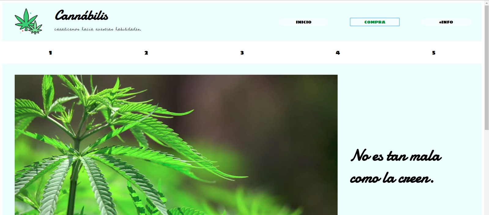

# Cannabilis

El cifrado césar es una forma de encriptado de caracteres muy antiguo que fue usado por el mismo Julio César para la guerra. 
Cannabilis es una página web que utiliza el cifrado césar para encriptar y desencriptar la interacción por mensajes entre usuarios compradores de marihuana y sus derivados, y los administradores de la página.

## Flujo de usuario

La página tiene una vista de inicio, donde muestra información relevante que la mayoría de la sociedad no toma en cuenta a la hora de calificar a la marihuana, la cual da pase y contexto al propósito de la página: comercializar productos derivados del cannabis. 

La siguiente opción de ruta y a donde se apunta a que el usuario continúe su navegación es hacia la compra. En esta hay una barra de navegación con pasos enumerados para completar la operación. La pantalla del primer paso explicará un poco más del proceso en las siguientes pantallas con respecto al uso del cifrado cesar, el porqué de él.

En el segundo paso empieza todo el proceso de compra: se pide al usuario que ingrese su mensaje pidiendo lo que desee adquirir con respecto a los productos ofrecidos a base de marihuana. También se les pide que inserten una clave en números para el cifrado césar. Cuando le dé click en el botón de cifrar, mostrará en la siguiente pantalla el mensaje codificado recordando su offset en caso desee descifrarlo más adelante; y la opción de editar su mensaje, así como el enviarlo de una vez.
La respuesta del mensaje llegará al correo del usuario (que se le pidió al momento de enviar el mensaje solicitando el producto) de manera codificada. Por ello, en el siguiente paso se encuentra el cuadro de texto para que el usuario inserte el mensaje y con el mismo numero clave pueda descifrar la respuesta llegada a su buzón. Ni bien clickee para descifrar, pasará al último paso donde se le mostrará la respuesta real para quien compre. Si necesita mayor interacción, puede volver a cifrar un mensaje o si le llegó un correo adicional, puede decodificar nuevamente.
Por último, se espera que esta iniciativa guste al público lo suficiente para compartirlo en sus redes y recomendarlo, por lo que dándole click al botón 'link', se capturará la url de la página para que pueda pegarla en cuantas redes sociales desee.
